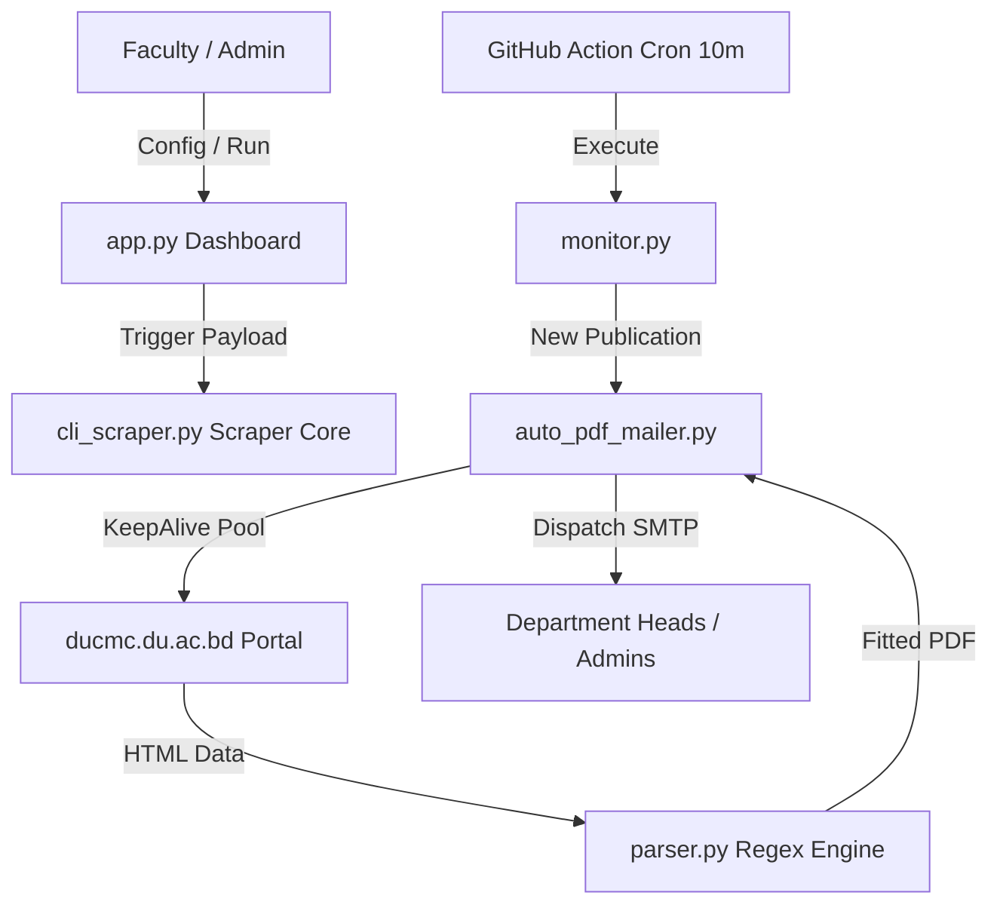

# Project: Result Finder & Academic Analytics Suite

High-performance academic result scraper, web dashboard portal, and high-frequency real-time exam monitor designed for Faridpur Engineering College (affiliated with the University of Dhaka). The suite coordinates multi-threaded crawling, secure department email routing, automated PDF generation, and batch directory discovery.

## Core Tech Stack
- **Language**: Python 3.10+
- **Frontend Dashboard**: Streamlit (featuring advanced CSS transitions, custom Outfit Google Fonts, and hover-triggered Selectbox javascript actions)
- **Scraper Engine**: Multi-threaded KeepAlive HTTPS Connection Pool (`http.client` / `queue.Queue`)
- **Reporting Pipeline**: HTML Jinja-like printable tables + `pdfkit` / `wkhtmltopdf` (loaded lazily)
- **Alert Dispatcher**: Secure `smtplib` (SSL encrypted, routing via Gmail SMTP)
- **Persistence Layer**: JSON Databases (`saved_profiles.json`, `known_exams.json`, `cse_exams.json`)

## Architecture & Lifecycles

## Development Conventions
1. **Zero-Dependency Fast Boot**: The checker routine (`monitor.py --check-only`) must never import third-party libraries (`pdfkit`, `jinja2`, etc.) to run in < 2 seconds.
2. **Resource Optimization**: Connection reuse through `KeepAlivePool` is mandatory to avoid SSL handshake bottlenecks during large batch scans.
3. **Ghost Student Filtering**: Senior re-add discovery must match target candidates against regular batch subject fingerprints. Only allow students with >= 50% subject overlap to prevent retake/improvement ghosts.
4. **Adaptive Backoffs**: Enforce global thread throttling and WAF backoffs on portal network connection errors to prevent captcha locks.
