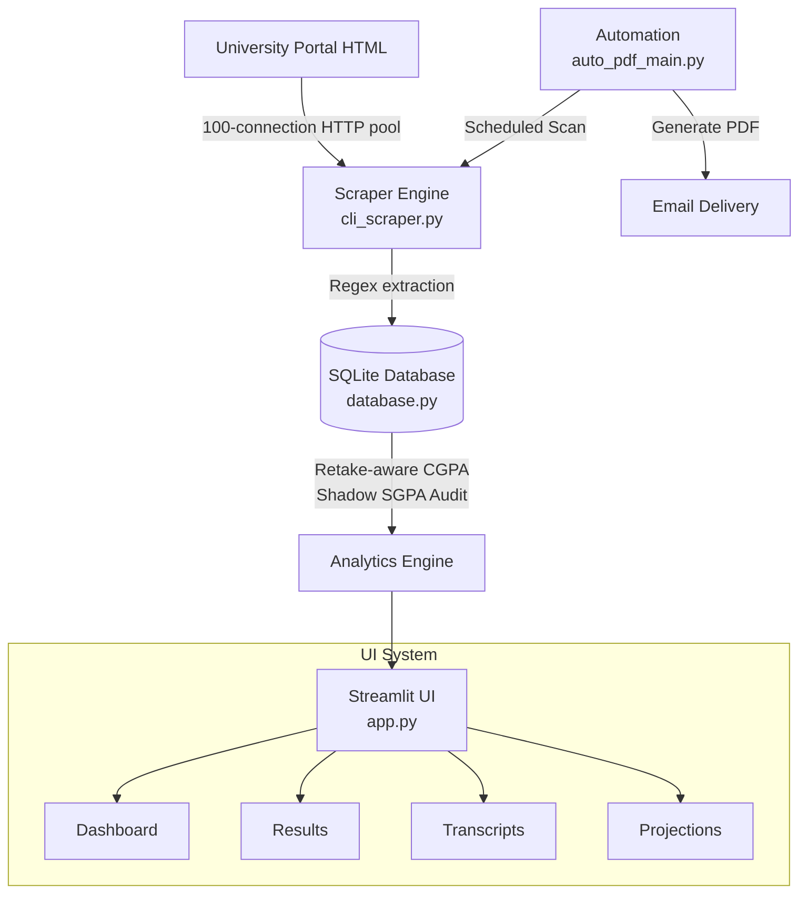

# Result Finder PRO (v2)

> **Academic Data Pipeline & Analytics Platform**  
> *From manual result-checking to automated intelligence — built for real university operations.*


---

## 🎯 The Vision

University portals typically show results one student at a time. No batch queries. No analytics. No longitudinal export. Faculty members used to spend hours manually checking cohorts every semester. 

**Result Finder PRO replaces a manual 3-hour process with a 90-second automated pipeline.**

This `v2` branch is the **full data platform rewrite**, transitioning the project from a simple scraper to an intelligent academic management system. It introduces persistent database storage, OLAP-style analytics, and comprehensive academic planning features.

*(Looking for the production CLI scraper & email automation? Switch to the [`main` branch](https://github.com/fahimfaisal570/Result-finder/tree/main).)*

---

## ⚡ Core Features (v2 Exclusive)

### 📊 Advanced Streamlit Dashboard
A multi-page interface replacing command-line output with rich, interactive visualizations.
- **Batch Scanning:** Ingest full cohorts into the database with a single click.
- **Analytics Hub:** View cross-batch benchmarks, grade distributions, and merit rankings.
- **GPA Projection & Simulator:** Calculate precise graduation trajectories with retake-aware simulation and elective credit mapping.

### 🛡️ ACID-Compliant Persistence (SQLite)
Moved from flat JSON files to a relational SQLite database (WAL mode) with 6 normalized tables.
- **Idempotent Upserts:** Run scans as many times as you want; unique constraints guarantee zero duplicate records.
- **Schema Migrations:** Automated versioning (`v1` → `v2` → `v3`) without data loss.

### 🧠 Intelligent Academic Analytics
- **Shadow SGPA Audit:** Detects and flags university portal rounding errors by validating every SGPA against a local database of 300+ official subject credits.
- **Retake-Aware CGPA Engine:** Evaluates complete student history and picks the *best* grade for repeated courses, computing true cumulative standing.
- **Readmission Resolution:** "Latest exam wins" semantics automatically merge histories for students repeating years across different batches.

---

## 🏗️ Architecture



---

## 🚀 Quick Start

### 1. Requirements
Ensure you have Python 3.10+ installed.

```bash
git clone https://github.com/fahimfaisal570/Result-finder.git -b v2
cd Result-finder
pip install -r requirements.txt
```

### 2. Run the Dashboard
Fire up the full interactive web application:

```bash
streamlit run app.py
```
*The app will automatically initialize the database schema (`result_finder.db`) on first run.*

### 3. Automated Monitoring (Optional)
Configure background syncing by setting your SMTP credentials, then run:

```bash
python v2_auto_sync.py
```

---

## 🧪 Testing

The platform includes a robust unit testing suite covering database idempotency, schema integrity, and the retake-aware CGPA math.

```bash
python -m unittest tests/test_database.py -v
python -m unittest tests/test_full_system.py -v
```

---

## 📄 License & Credits

Released under the **MIT License**.

Developed for academic excellence to bridge the gap between legacy university portals and modern data needs.

**Author:** [Fahim Faisal](https://www.linkedin.com/in/fahimfaisal09)