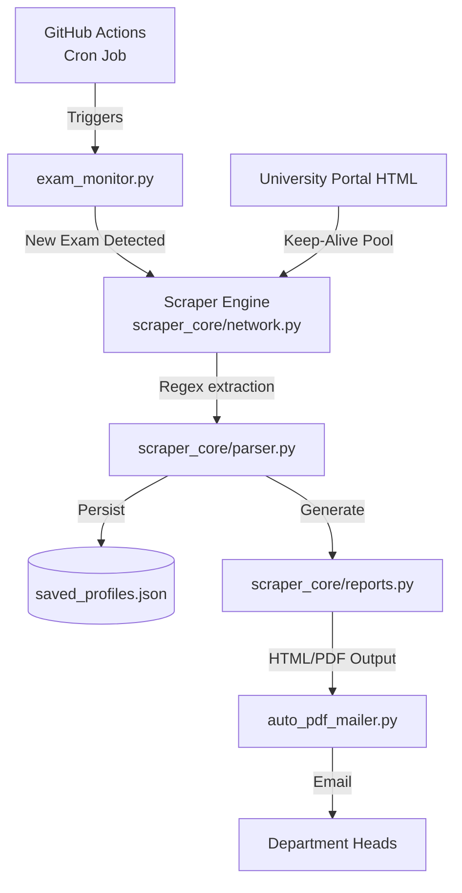

# Result Finder PRO (main)

> **Automated Scraper & Reporting Pipeline**  
> *Production-ready academic data extraction and automated email delivery.*


---

## 🎯 The Vision

The `main` branch serves as the **lightweight, production-grade automated scraper**. While the `v2` branch acts as a full interactive dashboard with SQLite persistence, `main` focuses on core reliability: scraping raw results, generating clean HTML/PDF reports, and delivering them automatically to department heads via email.

*(Looking for the full interactive Streamlit dashboard with SQLite and GPA simulation? Switch to the [`v2` branch](https://github.com/fahimfaisal570/Result-finder/tree/v2).)*

---

## ⚡ Core Features (main branch)

### 🕵️‍♂️ Robust Scraping Engine
- **100-Connection HTTP Pool:** Uses persistent keep-alive connections to bypass TLS handshake overhead, speeding up scraping by 3x.
- **Stealth & Resilience:** Implements dynamic User-Agent rotation, cookie pinning (PHPSESSID tracking), and exponential backoff to handle portal rate limits smoothly.
- **Regex Parsing:** Employs 40+ resilient regex patterns to structure messy HTML tables across 3 different department formats without relying on heavy DOM parsers like BeautifulSoup.

### 🤖 Automation Pipeline
- **GitHub Actions Integration:** Runs an `exam_monitor` cron job that periodically checks the university portal for new exam publications.
- **Automated Delivery:** When a new exam is detected, the system matches it to a saved batch profile, runs a full extraction, generates a formatted PDF, and automatically emails it to the respective Department Head via SMTP.

### 📄 Lightweight JSON Storage & Reporting
- **JSON Persistence:** Simple, portable `saved_profiles.json` storage without the overhead of a relational database.
- **HTML Transcripts:** Generates clean, offline-readable HTML records for full student academic histories.

---

## 🏗️ Architecture



---

## 🚀 Quick Start

### 1. Requirements
Ensure you have Python 3.10+ installed.

```bash
git clone https://github.com/fahimfaisal570/Result-finder.git -b main
cd Result-finder
pip install -r requirements.txt
```

### 2. Run the CLI Scraper
You can run the scraper directly from the command line (or Pydroid 3 on Android):

```bash
python cli_scraper.py
```

### 3. Configure Automated Monitoring
To enable the GitHub Actions automated mailer, set the following repository secrets:
- `EMAIL_USER`: Sending email address
- `EMAIL_PASS`: SMTP app password
- `RECEIVER_EMAIL`: System administrator email
- `CSE_HEAD_EMAIL` / `EEE_HEAD_EMAIL` / `CIVIL_HEAD_EMAIL`: Target department recipients

---

## 🧱 Code Structure

- `scraper_core/network.py`: HTTP pooling, retry logic, stealth measures.
- `scraper_core/parser.py`: HTML regex extraction and data normalization.
- `scraper_core/profiles.py`: Batch data management and JSON storage.
- `scraper_core/reports.py`: Data aggregation and HTML transcript generation.
- `exam_monitor/`: Automated detection and SMTP alerting pipeline.

---

## 📄 License & Credits

Released under the **MIT License**.

Developed for academic excellence to automate and streamline result distribution.

**Author:** [Fahim Faisal](https://www.linkedin.com/in/fahimfaisal09)