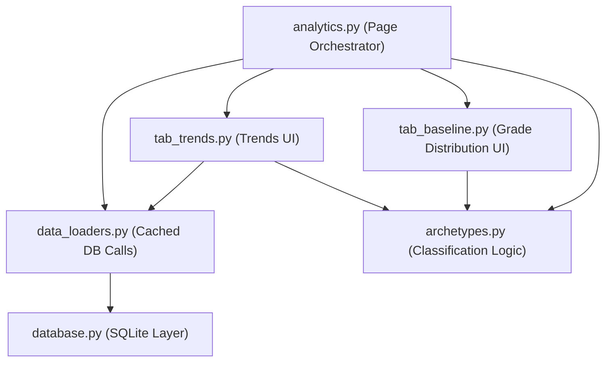

# Result Finder — Logic Extraction Report

> **Purpose:** Reference blueprint for implementing **Trends Mode**, **Grade Distribution Breakdown**, and the **Readd Note** in the separate project. Includes the **Longitudinal View** concept since it powers Trends.

---

## 1. Architecture Overview



### Data Flow
1. **`analytics.py`** loads sidebar selections (batch, semester, subject filters, CGPA range)
2. Calls `data_loaders` to fetch cached DataFrames
3. Builds a shared **`ctx` dict** passed to every tab renderer
4. Each tab calls `render(ctx)` and consumes `ctx` fields

### The `ctx` Dict (Shared State)
```python
ctx = {
    'profile_name': str,        # e.g. "civil 09"
    'exam_id': str,             # e.g. "1666"
    'selected_label': str,      # condensed exam name "3rd Yr 1st Sem '24 [1666]"
    'profiles': dict,           # all profiles from db.get_profiles()
    'df_main': DataFrame,       # per-student row: reg_no, name, gpa, cgpa, result_status, improvement_count, retake_count, first_chance_fail
    'df_sub': DataFrame,        # per-subject-per-student: reg_no, name, subject_code, subject_name, gp, credit_hours
    'df_pivot': DataFrame,      # pivot of df_sub: index=reg_no, columns=subject_code, values=gp
    'is_first_sem': bool,       # True if gpa==cgpa or "1st Yr 1st Sem" in label
    'promo_target': float,      # Year-based promotion threshold (2.00/2.25/2.50/2.75)
    'is_even_sem': bool,        # True if 2nd semester of year
    'promo_yr': int,            # 1-4
    'df_longitudinal': DataFrame | None,  # multi-semester GPA trajectory
    'selected_subjects': list,  # active subject filter
    'readd_reg_nos': list[str], # reg numbers of incomplete-history students
}
```

---

## 2. Longitudinal View (Powers Trends Mode)

### DB Function: `get_longitudinal_data(profile_name)` → `dict[reg_no → list]`

**Location:** [database.py:1648-1704](file:///c:/Users/Ucc/Downloads/result%20finder%20separate/database.py#L1648-L1704)

**What it does:**
- Queries ALL `exam_results` rows for the profile (joined with `students` for names)
- **Filters out retake/improvement exams** using keyword set: `{"retake", "re-take", "improvement", "special", "make-up", "makeup", "supplementary"}`
- **Groups by `(reg_no, semester_label)`** — extracts semester label via regex from exam name
- **Latest exam_id wins** per semester group (handles readmitted students who may have two different exam entries for the same "1st year 1st semester")
- Computes `semester_num` from label: `(year-1)*2 + sem_in_year`
- Returns `dict[reg_no → sorted list of {reg_no, name, exam_id, exam_name, gpa, cgpa, result_status, semester_num, semester_label}]`

**Key regexes:**
```python
# Extracts "1st year 2nd semester" type labels
SEM_LABEL_PATTERN = re.compile(
    r'(\d+(?:st|nd|rd|th)\s+year\s+\d+(?:st|nd|rd|th)\s+semester)', re.IGNORECASE
)
# Extracts year/sem numbers from the label
SEM_NUM_PATTERN = re.compile(
    r'(\d+)(?:st|nd|rd|th)\s+year\s+(\d+)(?:st|nd|rd|th)\s+semester', re.IGNORECASE
)
```

### How analytics.py loads it:
```python
# data_loaders.py
def load_longitudinal(profile_name):
    return db.get_longitudinal_data(profile_name)

# analytics.py (lines 247-256)
df_longitudinal_raw = data_loaders.load_longitudinal(profile_name)
if df_longitudinal_raw:
    df_longitudinal = pd.DataFrame([
        {**entry, 'reg_no': reg}
        for reg, entries in df_longitudinal_raw.items()
        for entry in entries
    ])
else:
    df_longitudinal = None
```

> [!IMPORTANT]
> The dict-to-DataFrame flattening adds `reg_no` as a column (it's the dict key). The resulting DataFrame has one row per student per semester, with columns: `reg_no, name, exam_id, exam_name, gpa, cgpa, result_status, semester_num, semester_label`.

---

## 3. Trends Mode (`tab_trends.py`)

**Location:** [tab_trends.py](file:///c:/Users/Ucc/Downloads/result%20finder%20separate/analytics_engine/tab_trends.py)

### 3.1 Batch GPA Trajectory Chart

**Logic:**
1. Requires `df_longitudinal` (multi-semester data). Shows warning if None/empty.
2. Computes **batch median** per semester: `df_longitudinal.groupby('semester_label')['gpa'].median()`
3. Renders an **Altair multi-line chart** — one line per student, plus a dashed white median line
4. **Spotlight feature**: selectbox lets user pick one student → that student gets `opacity=1.0, size=3, color=#ef4444`, all others get `opacity=0.1, size=1, color=#60a5fa`

**Chart spec:**
```python
line = alt.Chart(chart_data).mark_line().encode(
    x=alt.X('semester_num:O', title='Semester Sequence'),
    y=alt.Y('gpa:Q', scale=alt.Scale(domain=[1.5, 4.0])),
    detail='reg_no:N',
    opacity='opacity:Q',
    size='size:Q',
    color=alt.Color('color:N', scale=None),
    tooltip=['reg_no', 'semester_label', 'gpa']
)
median_line = alt.Chart(median_trend).mark_line(
    strokeDash=[5, 5], color='white', size=3
)  # ...
```

### 3.2 Student Trajectory Metrics Table

**Logic per student:**
```python
for reg, grp in df_longitudinal.groupby('reg_no'):
    gpas = grp.sort_values('semester_num')['gpa'].tolist()
    metrics.append({
        'Peak GPA': max(gpas),
        'Valley GPA': min(gpas),
        'Consistency': 1 - np.std(gpas),      # higher = more consistent
        'Trend Slope': np.polyfit(range(len(gpas)), gpas, 1)[0],  # linear regression slope
        'Trajectory': classify_trajectory(gpas)  # → "Rising"/"Declining"/"Recovery (V-shape)"/"Stable"
    })
```

**Trajectory Classification (`archetypes.classify_trajectory`):**
```python
def classify_trajectory(gpa_list):
    slope = np.polyfit(range(len(gpa_list)), gpa_list, 1)[0]
    if slope > 0.08: return "Rising"
    if slope < -0.08: return "Declining"
    # V-shape detection: valley in middle with significant drop and recovery
    min_idx = gpa_list.index(min(gpa_list))
    if min_idx > 0 and min_idx < len(gpa_list) - 1:
        pre_drop = gpa_list[min_idx - 1] - gpa_list[min_idx]
        post_rise = gpa_list[-1] - gpa_list[min_idx]
        if pre_drop > 0.2 and post_rise > 0.2:
            return "Recovery (V-shape)"
    return "Stable"
```

### 3.3 Retake & Improvement Success Tracker

**DB Function: `get_retake_success_stats(profile_name)` → `list[dict]`**

**Location:** [database.py:1706-1733](file:///c:/Users/Ucc/Downloads/result%20finder%20separate/database.py#L1706-L1733)

**SQL:**
```sql
SELECT sg.reg_no, s.name, sg.subject_code, sg.subject_name,
       MIN(sg.grade_point) as first_gp,
       MAX(sg.grade_point) as best_gp,
       COUNT(*) as attempts
FROM subject_grades sg
JOIN students s ON sg.profile_name = s.profile_name AND sg.reg_no = s.reg_no
WHERE sg.profile_name=?
GROUP BY sg.reg_no, sg.subject_code
HAVING COUNT(*) > 1
```

**Post-processing:**
```python
d['gp_gain'] = d['best_gp'] - d['first_gp']
d['passed_after_retake'] = d['first_gp'] < 2.00 and d['best_gp'] >= 2.00
```

**UI metrics:**
- Total Retake Attempts: `len(df_retake)`
- Success Rate: `(df_retake['gp_gain'] > 0).mean() * 100`
- Avg GP Gain: `df_retake['gp_gain'].mean()`
- Subjects Cleared: `df_retake['passed_after_retake'].sum()`
- Per-subject breakdown table grouped by `subject_code`

### 3.4 Cross-Batch Benchmarking

**DB Function: `get_cross_batch_comparison(profile_names, semester_pattern)` → `dict[profile → stats]`**

**Location:** [database.py:1735-1782](file:///c:/Users/Ucc/Downloads/result%20finder%20separate/database.py#L1735-L1782)

**Logic:**
1. For each profile, finds all exam entries matching the `semester_pattern` regex
2. **Filters out retake exams** (same keyword set)
3. **Picks the exam with the highest student count** (the "Main" cohort exam — avoids improvement exam pollution)
4. Fetches all GPA values for that winning exam_id
5. Returns per-profile: `{students, mean_gpa, median_gpa, pass_rate (≥2.20), honours_count (≥3.75), gpa_list}`

**UI:**
- User selects profiles via multiselect + enters a semester regex pattern
- Comparison table with formatted stats
- **Density curve chart** via `alt.Chart().transform_density('GPA', groupby=['Profile'])`

---

## 4. Grade Distribution Breakdown

**Location:** [tab_baseline.py:113-140](file:///c:/Users/Ucc/Downloads/result%20finder%20separate/analytics_engine/tab_baseline.py#L113-L140)

### GP-to-Letter Mapping (`archetypes.gp_to_letter`):
```python
def gp_to_letter(gp: float) -> str:
    if gp >= 4.00: return "A+"
    if gp >= 3.75: return "A"
    if gp >= 3.50: return "A-"
    if gp >= 3.25: return "B+"
    if gp >= 3.00: return "B"
    if gp >= 2.75: return "B-"
    if gp >= 2.50: return "C+"
    if gp >= 2.25: return "C"
    if gp >= 2.00: return "D"
    return "F"
```

### Chart Logic:
```python
df_grades = df_sub.copy()
df_grades['letter'] = df_grades['gp'].apply(gp_to_letter)

GRADE_ORDER = ["A+", "A", "A-", "B+", "B", "B-", "C+", "C", "D", "F"]
GRADE_COLORS = {
    "A+": "#059669", "A": "#10b981", "A-": "#34d399",
    "B+": "#3b82f6", "B": "#60a5fa", "B-": "#93c5fd",
    "C+": "#f59e0b", "C": "#fbbf24", "D": "#f97316", "F": "#ef4444"
}

# Ordinal mapping for stacking order
letter_order_map = {l: i for i, l in enumerate(GRADE_ORDER)}
df_grades['letter_order'] = df_grades['letter'].map(letter_order_map)

chart = alt.Chart(df_grades).mark_bar().encode(
    x=alt.X('subject_code:N', sort='-y', title='Subject'),
    y=alt.Y('count()', stack='normalize', title='Grade Distribution %',
            axis=alt.Axis(format='%')),
    color=alt.Color('letter:N',
        scale=alt.Scale(domain=GRADE_ORDER,
                        range=[GRADE_COLORS[g] for g in GRADE_ORDER]),
        sort=GRADE_ORDER,
        legend=alt.Legend(title='Grade')),
    order=alt.Order('letter_order:Q'),
    tooltip=['subject_code', 'letter', 'count()']
).properties(height=400)
```

> [!NOTE]
> This is a **100% stacked bar chart** — each subject column shows the proportional breakdown of grades. The `stack='normalize'` makes every bar the same height (100%), and `order=alt.Order('letter_order:Q')` ensures grades stack in the correct A+→F order.

### Data Source
Uses `df_sub` from `ctx` — the **filtered** subject-level DataFrame (`subject_code`, `subject_name`, `gp`, `reg_no`, etc.), already scoped to the selected exam and subject filters.

---

## 5. Readd Note (Below Integrated Batch Analytics Header)

**Location:** [analytics.py:100-112](file:///c:/Users/Ucc/Downloads/result%20finder%20separate/pages/analytics.py#L100-L112)

### Mechanism:
1. Reads `readd_notifications.json` from project root
2. Keyed by `"{profile_name}_{exam_id}"` (e.g. `"civil 09_1666"`)
3. Each entry is a list of `{reg_no, name, sess_id, source_profile}`
4. If the current profile+exam key exists and has entries, renders a `st.caption()`:

```python
notify_file = os.path.join(project_root, "readd_notifications.json")
if os.path.exists(notify_file):
    with open(notify_file, "r") as nf:
        notif_data = json.load(nf)
    key = f"{profile_name}_{exam_id}"
    if key in notif_data and notif_data[key]:
        readds = notif_data[key]
        readd_names = ", ".join([f"{r['name']} ({r['reg_no']})" for r in readds])
        st.caption(f"ℹ️ **Note:** {readd_names} joined this batch in this exam (Readmitted).")
```

### JSON Structure:
```json
{
    "civil 09_1666": [
        {
            "reg_no": 578,
            "name": "A.B.M. Faisal",
            "sess_id": "19",
            "source_profile": "civil 08"
        }
    ]
}
```

> [!TIP]
> The `readd_notifications.json` is **generated during the scan/ingest process** (in `v2_auto_sync.py` or the batch scan workflow). It's populated when the scanner detects a student's `sess_id` differs from the batch's primary session (meaning they're from an older cohort).

### Incomplete History Scanner (Related)
Separately, `db.get_incomplete_history_students(profile_name)` detects students with fewer exam records than the profile's total scan count. These are rendered in an **expander** (not the caption note). This provides a "Scan & Fix" button to resolve missing semester data for readmitted students.

**SQL:**
```sql
SELECT s.reg_no, s.name, s.sess_id,
       COUNT(DISTINCT er.exam_id) as student_exam_count
FROM students s
LEFT JOIN exam_results er ON s.profile_name = er.profile_name AND s.reg_no = er.reg_no
WHERE s.profile_name=?
GROUP BY s.reg_no
HAVING COUNT(DISTINCT er.exam_id) < ?  -- less than profile's total exam count
ORDER BY student_exam_count ASC
```

---

## 6. Supporting Database Schema

```sql
-- Core tables (relevant to the features above)

CREATE TABLE profiles (
    name     TEXT PRIMARY KEY,     -- "civil 09", "cse 10"
    pro_id   TEXT NOT NULL,        -- portal program ID
    sess_id  TEXT,                 -- default session ID
    timestamp REAL
);

CREATE TABLE students (
    profile_name TEXT NOT NULL,
    reg_no       INTEGER NOT NULL,
    name         TEXT,
    sess_id      TEXT,
    UNIQUE(profile_name, reg_no)
);

CREATE TABLE exam_results (
    profile_name  TEXT NOT NULL,
    reg_no        INTEGER NOT NULL,
    exam_id       TEXT NOT NULL,
    exam_name     TEXT,
    result_status TEXT,
    gpa          REAL DEFAULT 0.0,
    cgpa          REAL DEFAULT 0.0,
    portal_gpa   REAL,
    portal_cgpa   REAL,
    raw_json      TEXT,
    UNIQUE(profile_name, reg_no, exam_id)
);

CREATE TABLE subject_grades (
    profile_name TEXT NOT NULL,
    reg_no       INTEGER NOT NULL,
    exam_id      TEXT NOT NULL,
    subject_code TEXT NOT NULL,
    subject_name TEXT,
    grade_point  REAL DEFAULT 0.0,
    credit_hours REAL DEFAULT 3.0,
    UNIQUE(profile_name, reg_no, subject_code, exam_id)
);

CREATE TABLE scan_log (
    profile_name  TEXT NOT NULL,
    exam_id       TEXT NOT NULL,
    scanned_at    REAL NOT NULL,
    student_count INTEGER DEFAULT 0,
    PRIMARY KEY(profile_name, exam_id)
);
```

---

## 7. Key Patterns to Replicate

### Pattern: "Latest Exam ID Wins"
Used everywhere multi-semester data exists. When a readmitted student has two entries for "1st year 1st semester" (one from their old batch, one from the new), the entry with the **higher numeric `exam_id`** is kept. This is the de-duplication strategy for longitudinal, cross-batch, and deep analysis.

### Pattern: Retake Keyword Filtering
Any exam name containing `{"retake", "re-take", "improvement", "special", "make-up", "makeup", "supplementary"}` is excluded from main-semester analysis. These are only used in the retake success tracker.

### Pattern: Semester Number Derivation
```python
# From exam name label: "3rd year 1st semester" → semester_num = (3-1)*2 + 1 = 5
semester_num = (year - 1) * 2 + sem_in_year
```

### Pattern: Promotion Rules
```python
Year 1 → promo_target = 2.00
Year 2 → promo_target = 2.25
Year 3 → promo_target = 2.50
Year 4 → promo_target = 2.75
```

### Pattern: First-Semester Fallback
When `df_main['cgpa'].sum() == 0` or `gpa == cgpa`, the system treats it as first semester and uses GPA instead of CGPA for rankings, disables promotion logic, and shows "Initial Baseline" instead of momentum.
