# Result Finder PRO v2 — Complete System Documentation

> **Author:** Fahim Faisal  
> **Repository:** `fahimfaisal570/Result-finder`  
> **Branches:** `main` (JSON-based legacy) · `v2` (SQLite-backed, active development)  
> **License:** MIT  
> **Target Portal:** DUCMC — Dhaka University Constituent Colleges (`ducmc.du.ac.bd`)  
> **Departments Served:** B.Sc. in CSE, EEE, Civil Engineering (Faridpur Engineering College)

---

## Table of Contents

1. [Problem Statement](#1-problem-statement)
2. [Solution Overview](#2-solution-overview)
3. [High-Level Architecture](#3-high-level-architecture)
4. [Branch Strategy (main ↔ v2)](#4-branch-strategy-main--v2)
5. [Technology Stack](#5-technology-stack)
6. [Module-by-Module Breakdown](#6-module-by-module-breakdown)
   - 6.1 [app.py — Dashboard & Navigation Hub](#61-apppy--dashboard--navigation-hub)
   - 6.2 [cli_scraper.py — Scraping Engine](#62-cli_scraperpy--scraping-engine)
   - 6.3 [database.py — SQLite Persistence Layer](#63-databasepy--sqlite-persistence-layer)
   - 6.4 [pages/results.py — Exam Scan Page](#64-pagesresultspy--exam-scan-page)
   - 6.5 [pages/transcript.py — Student Record Page](#65-pagestranscriptpy--student-record-page)
   - 6.6 [pages/analytics.py — OLAP Analytics Dashboard](#66-pagesanalyticspy--olap-analytics-dashboard)
   - 6.7 [ui_components.py — Design System](#67-ui_componentspy--design-system)
   - 6.8 [pdf_extractor.py — Credit Mapping Builder](#68-pdf_extractorpy--credit-mapping-builder)
   - 6.9 [exam_monitor/ — Automated Exam Watcher](#69-exam_monitor--automated-exam-watcher)
   - 6.10 [portal_monitor/ — Uptime Health Checker](#610-portal_monitor--uptime-health-checker)
   - 6.11 [v2_auto_sync.py — Cross-Branch Sync Worker](#611-v2_auto_syncpy--cross-branch-sync-worker)
7. [Database Schema](#7-database-schema)
8. [Data Flow & System Diagrams](#8-data-flow--system-diagrams)
9. [Core Algorithms](#9-core-algorithms)
10. [Feature Catalogue](#10-feature-catalogue)
11. [CI/CD & Automation](#11-cicd--automation)
12. [Test Suite](#12-test-suite)
13. [File Inventory](#13-file-inventory)

---

## 1. Problem Statement

The DUCMC university portal (`ducmc.du.ac.bd`) is the only official source for academic results for three B.Sc. Engineering departments at Faridpur Engineering College. However, it has critical limitations:

| Problem | Impact |
|---------|--------|
| **One-student-at-a-time lookup** | Faculty must manually enter each student's registration number to view results — for a batch of 60+ students, this takes hours |
| **No batch overview** | No way to see an entire class's performance at a glance |
| **No analytics** | No GPA distributions, trends, risk detection, or cross-batch comparisons |
| **Portal-claimed CGPA is often wrong** | The portal's CGPA calculation doesn't always account for retakes/improvements correctly |
| **No retake/improvement tracking** | No way to see which subjects a student retook, whether grades improved, or what's still pending |
| **No automated alerts** | Faculty have no way to know when new results are published without manually checking the portal |
| **Frequent downtime** | The portal goes offline without notice; nobody is alerted |
| **No graduation planning** | Students cannot project their graduation CGPA or determine what grades they need |

---

## 2. Solution Overview

Result Finder is a **full-stack academic intelligence platform** that transforms the university portal from a single-lookup tool into a comprehensive analytics and monitoring system.

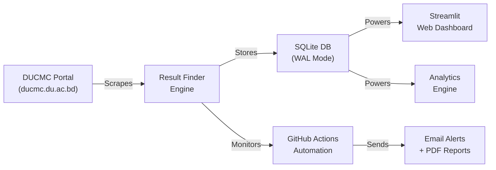

### What it does, end to end:

1. **Scrapes** the university portal for exam results using concurrent threads (10–15 workers)
2. **Stores** everything in a local SQLite database with ACID guarantees and retake awareness
3. **Verifies** portal-claimed GPAs against locally-computed GPAs using official syllabus credit mappings
4. **Analyzes** batch performance with 20+ interactive visualizations across 6 analytics tabs
5. **Projects** individual student graduation CGPAs with per-course simulation
6. **Monitors** the portal 24/7 for new exam publications and sends automated PDF reports to department heads
7. **Detects** re-admitted ("readd") students from senior batches using subject-overlap fingerprinting
8. **Tracks** portal uptime and alerts administrators on state changes

---

## 3. High-Level Architecture

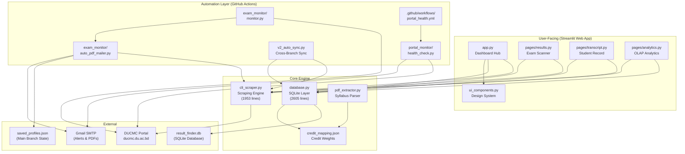

---

## 4. Branch Strategy (main ↔ v2)

The repository uses a **two-branch production architecture** where both branches are deployed simultaneously and work together:

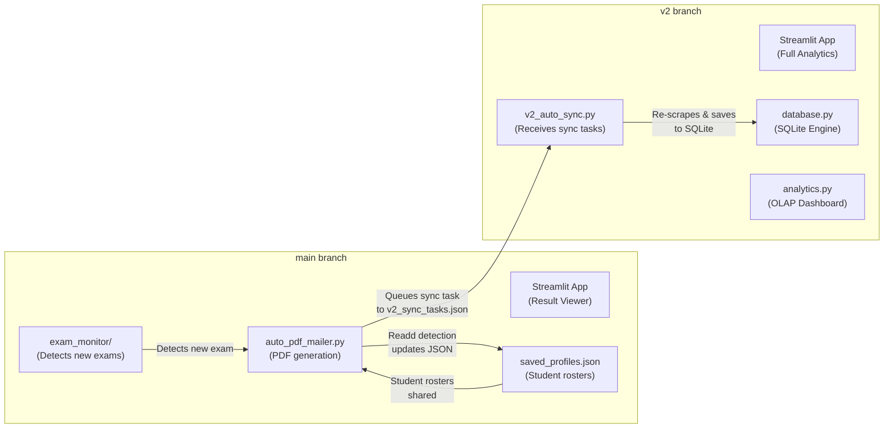

| Aspect | `main` Branch | `v2` Branch |
|--------|--------------|-------------|
| **Storage** | `saved_profiles.json` (flat file) | `result_finder.db` (SQLite with WAL) |
| **Deployment** | `fec-result-finder.streamlit.app` | `fec-result-analytics.streamlit.app` |
| **Primary Role** | Exam monitoring, PDF generation, result viewing | Analytics, projections, deep analysis |
| **Scraping** | CLI-native + web UI | Web UI + background sync |
| **Exam Monitor** | ✅ Runs here (GitHub Actions) | Receives sync tasks from main |
| **Analytics Dashboard** | ❌ Not available | ✅ Full 6-tab OLAP analytics |
| **Readd Detection** | Subject-overlap fingerprinting on `saved_profiles.json` | Same algorithm on SQLite DB |
| **Auto-Promotion** | Clears `is_provisional` in JSON | Clears `is_provisional` in SQLite |

### Cross-Branch Sync Flow

When the exam monitor on `main` detects a new exam:

1. `monitor.py` detects new main exam IDs
2. `auto_pdf_mailer.py` identifies the target batch profile, scrapes results, generates PDF, emails it
3. A sync task is written to `v2_sync_tasks.json` (temp file)
4. GitHub Actions workflow checks out the `v2` branch and runs `v2_auto_sync.py`
5. `v2_auto_sync.py` re-scrapes the same results and saves them to the SQLite database
6. Both branches now have the same data in their respective storage formats

---

## 5. Technology Stack

| Layer | Technology | Version | Purpose |
|-------|-----------|---------|---------|
| **Frontend** | Streamlit | 1.58.0 | Multi-page web dashboard |
| **Data** | pandas | 3.0.3 | DataFrames, pivots, aggregations |
| **Charts** | Altair | 6.2.2 | All interactive visualizations |
| **Math** | NumPy | 2.5.0 | Polyfit regression, statistics |
| **HTTP** | requests | 2.34.2 | Portal scraping with connection pooling |
| **Database** | SQLite | stdlib | ACID-safe persistence (WAL mode) |
| **PDF Parse** | pypdf | 6.14.2 | Syllabus credit extraction |
| **PDF Gen** | pdfkit | 1.0.0 | HTML→PDF batch reports |
| **Email** | smtplib | stdlib | Gmail SMTP_SSL alerts |
| **CI/CD** | GitHub Actions | — | Automated monitoring workflows |
| **Fonts** | Google Fonts | — | Inter, Outfit, Fira Code |

> [!NOTE]
> The project uses **zero JavaScript frameworks** and **zero CSS frameworks**. All styling is hand-written CSS injected via Streamlit's `st.markdown(unsafe_allow_html=True)`.

---

## 6. Module-by-Module Breakdown

### 6.1 `app.py` — Dashboard & Navigation Hub

**Size:** 445 lines · **Role:** Main entry point, sidebar navigation, profile management

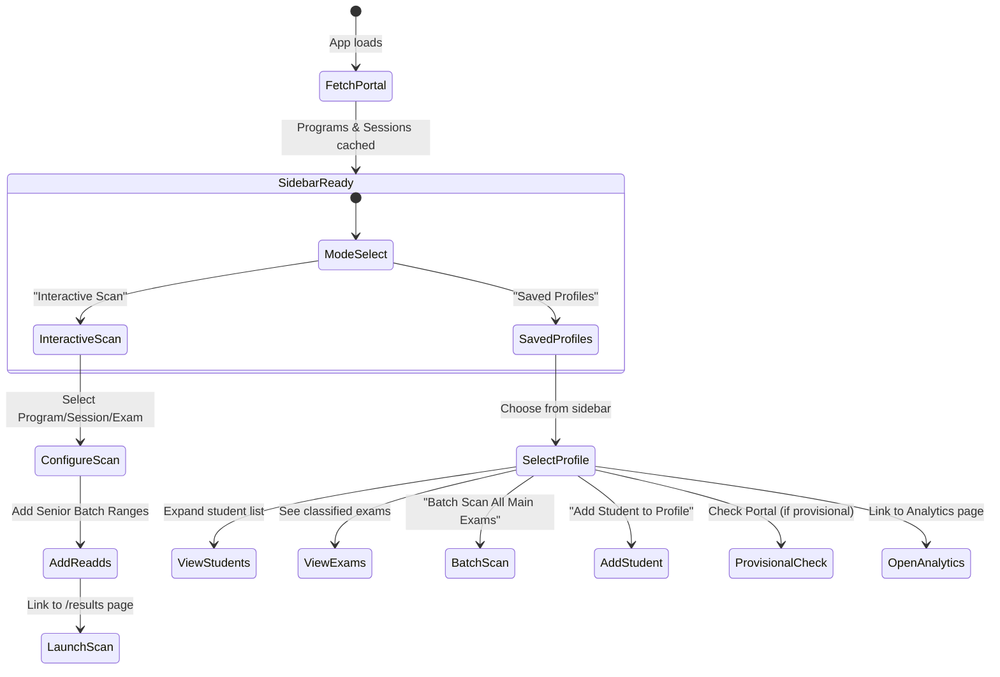

**Key Features:**
- **Two Operating Modes:** Interactive Scan (ad-hoc portal queries) and Saved Profiles (persistent batch management)
- **Provisional Batch Creation:** Create a student roster before exam results are published. The system will auto-promote it to a full profile once results are imported.
- **Senior Re-add Support:** In Interactive Scan mode, users can add additional registration ranges from different sessions (senior students repeating a year).
- **Add Student to Profile:** Scan specific registration numbers against the portal and add verified students to an existing profile. Handles duplicates gracefully.
- **Smart Exam Classification:** Exams are auto-classified into "Main Exams" and "Retake/Other" using keyword filtering and probe verification.
- **One-Click Batch Scan:** A single button scans all detected main semester exams sequentially.

---

### 6.2 `cli_scraper.py` — Scraping Engine

**Size:** 1,953 lines · **Role:** Portal communication, HTML parsing, batch scanning, HTML report generation

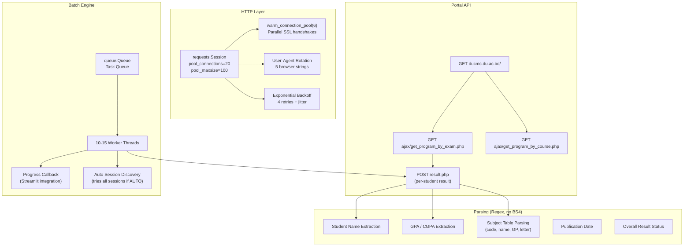

**Key Features:**

| Feature | Details |
|---------|---------|
| **Connection Pre-Warming** | 6 parallel SSL/TLS connections pre-established on startup. Reduces cold-start from ~20s to ~3-4s |
| **Batch Scan Engine** | `run_batch_scan_engine()` — Queue-based multi-threaded scanner. Supports flex-tasks: `(reg, sess)` or `(reg, sess, exam)` |
| **Exam Classification** | Scoring system: session tag match (+10), calendar offset match (+20), "new curriculum" (+5), "old syllabus" (−5). Probe verification: fetches one student's result to validate |
| **HTML Report Generation** | `generate_html_report()` — Print-optimized HTML with registration-wise table, scholarship eligibility list (top half by SGPA), CGPA ranking. Times New Roman font |
| **Transcript Generation** | `generate_transcript_report()` — Dark-themed HTML with per-exam subject tables, CSS variables, chronological ordering |
| **Profile Management (CLI)** | Full CRUD: Add/Remove students, Delete/Rename profiles, Export/Import JSON, Smart Purge Scan |
| **Auto Session Discovery** | When `sess_id="AUTO"`, tries all available sessions to find the student — handles readd students from different batches |
| **Regex-Only Parsing** | Zero dependency on BeautifulSoup. All HTML parsed with compiled regex patterns for speed |

---

### 6.3 `database.py` — SQLite Persistence Layer

**Size:** 2,605 lines · **Role:** ACID-safe storage, retake-aware CGPA, deep analysis, graduation projections

> [!IMPORTANT]
> This is the largest and most critical module. It contains the entire data model, all CGPA mathematics, the graduation projection engine, and the readd detection helpers.

**Key Responsibilities:**

| Area | Functions | Description |
|------|-----------|-------------|
| **Connection Pooling** | `get_connection()`, `ClosedOnExitConnection` | Thread-local SQLite pool, keyed by `DB_PATH`. WAL journal mode, 30s busy timeout, FK enforcement |
| **Schema Migrations** | `init_db()`, `migrate_schema_v2()` → `v5()` | Idempotent, safe to re-run. Auto-runs on module import |
| **Credit Mapping** | `get_subject_credits()`, `get_dept_from_profile()` | 3-tier lookup: semester-aware overrides → exam-specific overrides → department bucket → `None` fallback |
| **Profile CRUD** | `save_profile_and_results()`, `save_provisional_profile()`, `promote_provisional_profile()`, `delete_profile()`, `rename_profile()` | Full lifecycle management. Batch statement support |
| **Result Upserts** | `upsert_exam_result()`, `upsert_subject_grades()`, `upsert_student()` | Idempotent. Shadow GPA auditing (stores portal's claimed GPA alongside locally computed GPA) |
| **Per-Exam Analytics** | `get_student_data_for_exam()`, `get_subject_data_for_exam()` | GPA/CGPA per student for one exam. Includes improvement/retake counts, first_chance_fail detection |
| **Retake-Aware CGPA** | `get_effective_cgpa_per_student()` | Best grade across all attempts. Classification: improvement (2.0≤GP≤2.75), retake (GP<2.0) |
| **Deep Analysis** | `compute_deep_analysis()` | Full academic history processing: main vs retake classification, semester grouping, void future semesters for readds, effective grades, true CGPA, promotion thresholds |
| **Graduation Projection** | `compute_graduation_projection()`, `compute_graduation_cgpa_from_inputs()` | Target CGPA → required average GPA. Per-course simulation with elective credit caps |
| **Advanced Projection** | `compute_advanced_projection()`, `compute_adjusted_cgpa()`, `compute_per_semester_breakdown()` | Classifies subjects into pending retakes / improvement candidates / cleared. Computes adjusted CGPA with overrides |
| **Cross-Batch** | `get_cross_batch_comparison()`, `get_longitudinal_data()`, `get_retake_success_stats()` | Multi-profile benchmarking, semester trajectories, retake success rates |
| **Readd Helpers** | `get_senior_batch_profiles()`, `get_profile_student_regs()`, `get_incomplete_history_students()`, `save_cross_batch_history()` | Support readd detection and history repair |

**Shadow GPA Audit System:**

The portal's claimed GPA is not always correct. `database.py` independently computes GPA using credit mappings from official syllabus PDFs and stores both values:

```
exam_results.gpa         ← Locally computed (credit-weighted)
exam_results.portal_gpa  ← Portal's claimed value
exam_results.cgpa        ← Locally computed cumulative
exam_results.portal_cgpa ← Portal's claimed cumulative
```

When drift is detected, it is logged for investigation.

---

### 6.4 `pages/results.py` — Exam Scan Page

**Size:** 256 lines · **Role:** Receives scan parameters, runs scraper, displays results, saves to DB

**Two Operating Modes:**

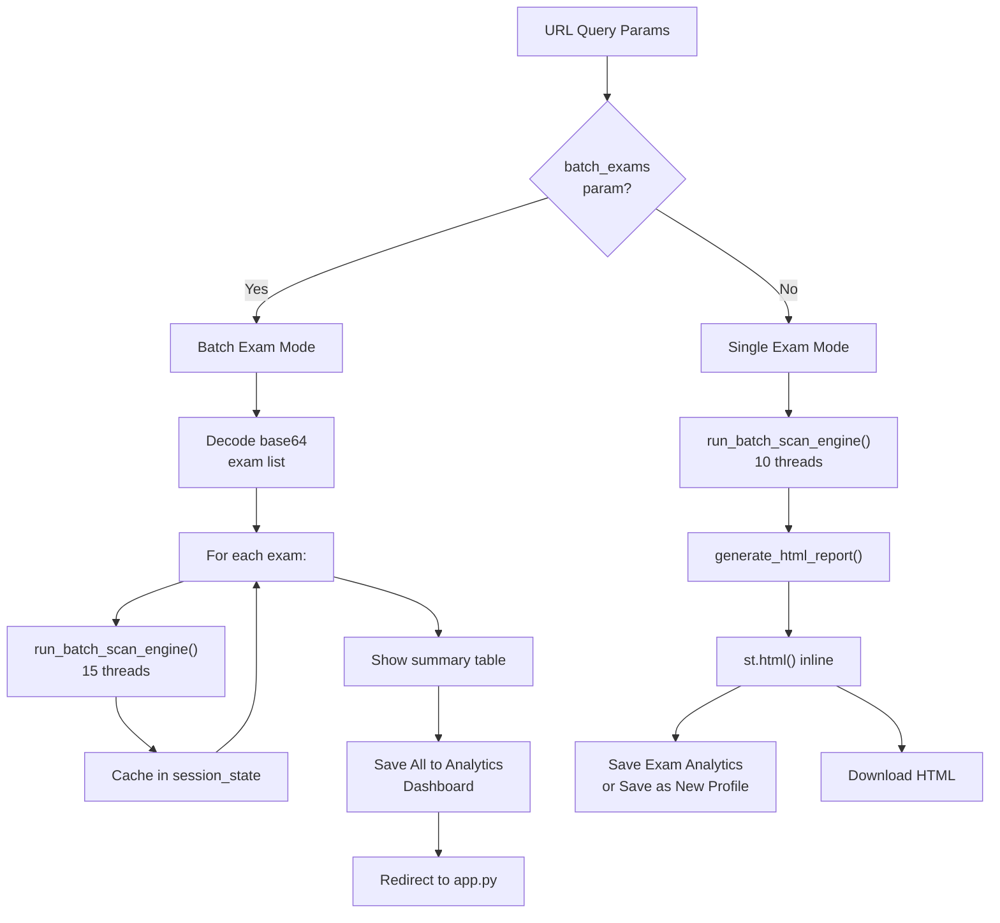

**Data Source Priority:**
1. Multi-batch payload (base64 JSON in URL) — from "Batch Scan All Main Exams"
2. Saved profile name — from exam links on dashboard
3. Manual range parameters — from Interactive Scan mode

---

### 6.5 `pages/transcript.py` — Student Record Page

**Size:** 170 lines · **Role:** Individual student's full academic history

**Smart Scope Optimization:**

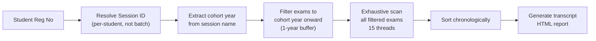

**Key Design Decisions:**
- **Per-student session resolution:** Readd students may have a different session than the batch default. The system looks up each student's individual `sess_id` from the profile's registration list.
- **Cohort year filtering:** A 2022-session student doesn't need to be scanned against 2018 exams. Only exams from their cohort year onward (with 1-year buffer) are probed. This reduces scan time from ~5 minutes to ~1-2 minutes.
- **Session-pinned scanning:** Each exam probe uses the student's specific `sess_id` to prevent registration number collisions across batches.

---

### 6.6 `pages/analytics.py` — OLAP Analytics Dashboard

**Size:** 2,183 lines · **Role:** The most complex module. Full batch analytics with 6 interactive tabs.

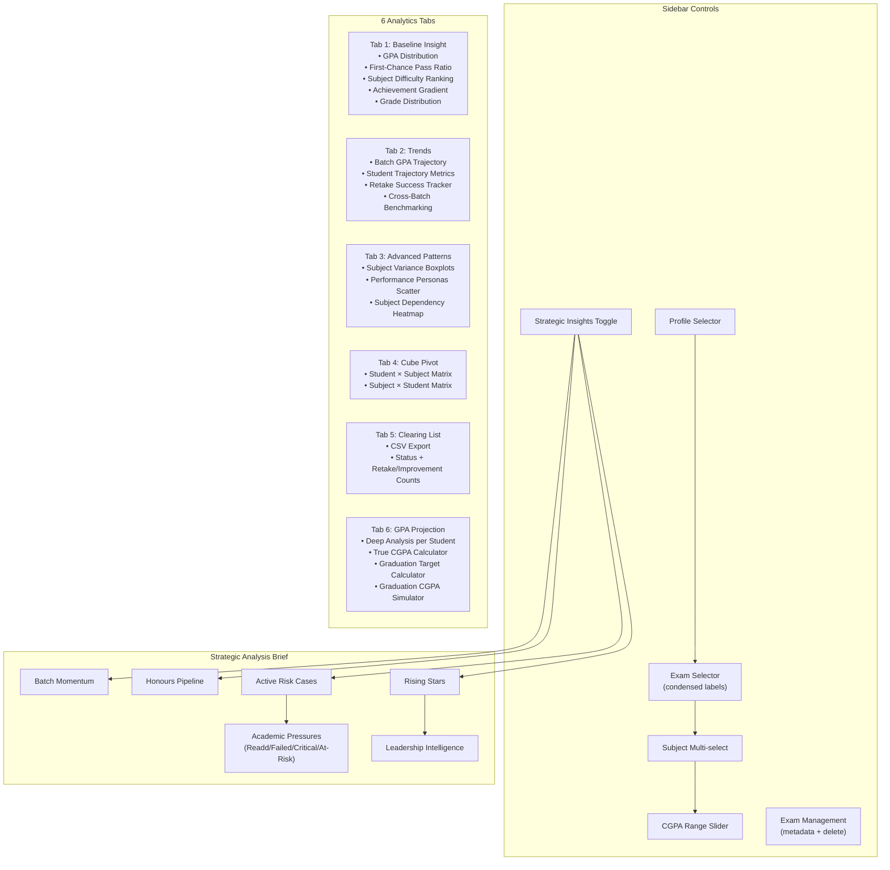

#### Tab 1: Baseline Insight — Batch Health at a Glance

| Visualization | Type | Description |
|--------------|------|-------------|
| GPA Distribution | Altair Histogram | 40 bins, step=0.05, adaptive axis (removes 0–2 void) |
| First-Chance Pass Ratio | Donut Chart | Green/red pie — % of students who passed all subjects on first attempt |
| Subject Difficulty Ranking | Horizontal Bar | Sorted by mean GP (passing grades ≥2.0 only), base anchored at 2.0 |
| Achievement Gradient | Line Chart | Rank vs CGPA (or GPA for 1st semester), adaptive Y-axis |
| Grade Distribution | 100% Stacked Bar | Per subject, A+ through F with curated color scale |

#### Tab 2: Trends — Longitudinal Analysis

| Visualization | Type | Description |
|--------------|------|-------------|
| Batch GPA Trajectory | Multi-line + Median | All students' GPA across semesters. Spotlight selector highlights one student in red. Dashed white median line |
| Student Trajectory Metrics | Data Table | Peak, valley, consistency (1−σ), trajectory classification (Rising/Declining/V-shape Recovery/Stable) via linear regression |
| Retake Success Tracker | Metrics + Table | Total retakes, success rate, avg GP gain, subjects cleared. Per-subject breakdown |
| Cross-Batch Benchmarking | Table + Density Curve | Compare multiple profiles on same semester. Mean/median GPA, pass rate, honours count. Overlaid density curves |

#### Tab 3: Advanced Patterns — Deep Statistical Analysis

| Visualization | Type | Description |
|--------------|------|-------------|
| Subject Variance | Boxplot | Min-max extent per subject, clipped [2.0, 4.0] |
| Performance Personas | Scatter Plot | X=Momentum (or Variance for 1st sem), Y=GPA. 24-color archetype coding. ⚠️ emoji for danger archetypes. Spotlight ring. Zero-line. Interactive zoom |
| Subject Dependency | Heatmap | Pearson correlation matrix, red-blue scheme |

#### Tab 4: Cube Pivot — Raw Data Exploration

Two modes: Student × Subject GP matrix, or transposed Subject × Student matrix. Both rendered as interactive DataFrames.

#### Tab 5: Clearing List — Export-Ready Roster

Sortable table with reg_no, name, GPA, CGPA, result_status, improvement_count, retake_count. CSV download button.

#### Tab 6: GPA Projection — Individual Student Planning

This is the most feature-rich tab. For each student (paginated, 10 per page):

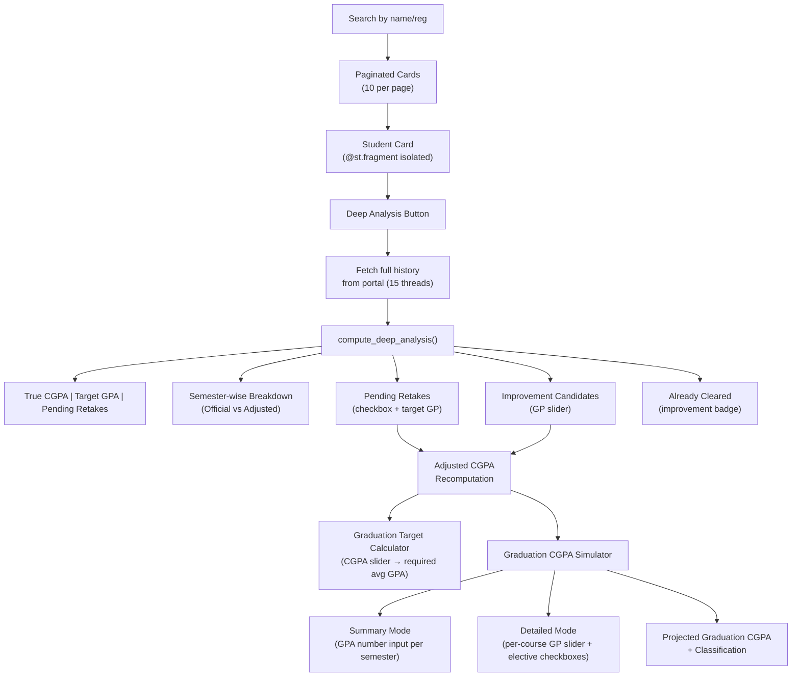

**GPA Simulator Modes:**
- **Summary Mode:** Enter expected GPA per remaining semester as a single number
- **Detailed Mode:** Set per-course grade point using select sliders (0.00/F, 2.00–4.00). For CSE semesters 7–8 and Civil semester 8, elective courses appear as checkboxes with a hard credit cap enforced

**Classification Output:**
- First Class with Distinction (≥3.75)
- First Class (≥3.50)
- Second Class Upper (≥3.25)
- Second Class (≥2.75)
- Pass (≥2.00)
- Below minimum graduation threshold

---

### 6.7 `ui_components.py` — Design System

**Size:** 311 lines · **Role:** Consistent UI styling and branding

**Two exported functions:**

| Function | Purpose |
|----------|---------|
| `inject_essential_ui()` | Injects ~200 lines of CSS (Google Fonts, mobile responsive, metric card glass effect, premium button gradients, etc.) + JavaScript for hover-to-open selectboxes |
| `add_contact_section()` | Renders animated footer with LinkedIn/Facebook SVG icons |

**Typography System:**
- **Body text:** Inter (sans-serif)
- **Headings:** Outfit (sans-serif, weight 600–700)
- **Code/Data:** Fira Code (monospace)
- **Metric labels:** Inter, uppercase, 0.75rem, letter-spacing 0.05em

**Mobile Responsive:** Columns stack at ≤768px. Metrics get extra bottom margin.

---

### 6.8 `pdf_extractor.py` — Credit Mapping Builder

**Size:** 153 lines · **Role:** One-time utility to extract credit hours from official syllabus PDFs

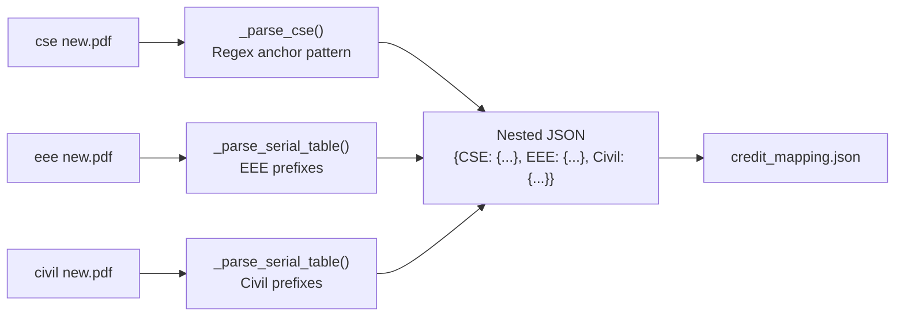

**Why department-isolated?** The same course code (e.g., `CSE-1101`) can have different credit values across departments (2.0 in CSE, 3.0 in EEE). The nested structure preserves this.

**Fallback heuristic:** If credit not found in PDF text, last digit odd = 3.0 (theory), even = 1.5 (lab).

---

### 6.9 `exam_monitor/` — Automated Exam Watcher

**Components:**

| File | Lines | Purpose |
|------|-------|---------|
| `monitor.py` | 208 | Core polling engine — checks portal for new exam IDs |
| `auto_pdf_mailer.py` | 488 | PDF generation pipeline — scrapes, generates report, emails |
| `find_latest.py` | 35 | Quick utility to find latest main exam per department |
| `sync_state.py` | 29 | State reset utility — overwrites known_exams.json with current state |
| `known_exams.json` | 282 | Persistent state — all known exam IDs per department |

**Detection Flow:**

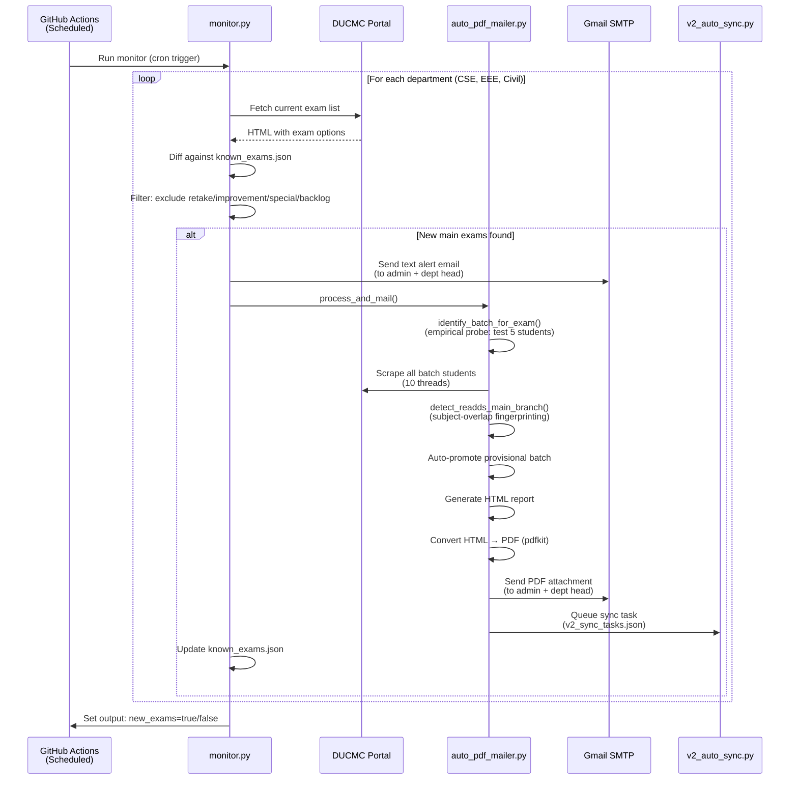

**Exam Filtering — Exclusion Keywords:**
`retake`, `improvement`, `special`, `clearance`, `backlog`, `junior`, `short`, `carry`

Only exams NOT matching any of these keywords are treated as "main" exams worthy of alerts.

**Email Routing:**

| Department | Program ID | Secret Key | Recipient |
|-----------|-----------|------------|-----------|
| Civil Engineering | 12 | `CIVIL_HEAD_EMAIL` | Department Head |
| EEE | 13 | `EEE_HEAD_EMAIL` | Department Head |
| CSE | 14 | `CSE_HEAD_EMAIL` | Department Head |
| All | — | `RECEIVER_EMAIL` | System Admin |

All emails include high-priority headers (`X-Priority: 1`, `Importance: High`) to trigger phone push notifications.

---

### 6.10 `portal_monitor/` — Uptime Health Checker

**Size:** 194 lines · **Role:** Completely isolated portal uptime monitoring

**Components:**
| File | Purpose |
|------|---------|
| `health_check.py` | Checks portal status, sends alerts on state transitions |
| `state.json` | Persists last known status + timestamp |

**Positive Verification (White-list approach):**
The portal is only considered "online" if:
- ✅ Response contains "DUCMC" AND "University of Dhaka"
- ✅ No CrowdSec/WAF blocks detected
- ✅ No HTTP 401/403 errors

**Alert Policy:** Emails are sent **only on state transitions** (online→offline or offline→online), not on every check. This prevents alert fatigue.

**State Persistence:** Uses GitHub Actions Cache (not git commits) to persist `state.json` across runs — avoids polluting git history.

**CLI Flags:** `--force-online`, `--force-offline` (manual test), `--test-email` (force alert dispatch)

---

### 6.11 `v2_auto_sync.py` — Cross-Branch Sync Worker

**Size:** 260 lines · **Role:** Receives sync tasks from `main` branch and replays them into the `v2` SQLite database

**What it does:**
1. Reads `v2_sync_tasks.json` from system temp directory
2. For each task: loads profile from DB → builds scan tasks → re-scrapes from portal → saves to SQLite
3. Auto-promotes provisional profiles
4. Runs readd detection (same subject-overlap algorithm as `main`)
5. Saves readd notifications to `readd_notifications.json` for the analytics dashboard
6. Cleans up temp sync file

---

## 7. Database Schema

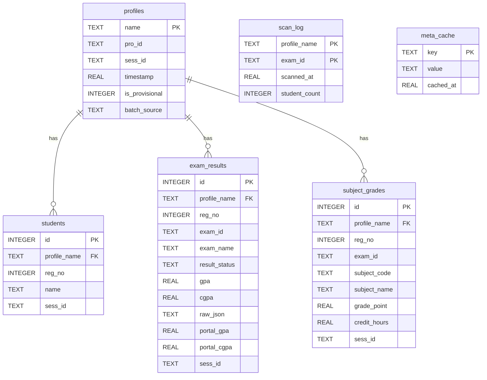

### Schema Migration History

| Version | Migration | Key Changes |
|---------|-----------|-------------|
| **v1** | `init_db()` | Base tables: profiles, students, exam_results, meta_cache. WAL journal mode |
| **v2** | `migrate_schema_v2()` | Adds subject_grades, scan_log. De-duplicates legacy rows |
| **v3** | `migrate_schema_v3()` | Adds `portal_gpa`, `portal_cgpa` columns for shadow auditing |
| **v4** | `migrate_schema_v4()` | Adds `sess_id` to exam_results and subject_grades. Recreates tables with updated UNIQUE constraints including sess_id. Backfills from students table |
| **v5** | `migrate_schema_v5()` | Adds `is_provisional`, `batch_source` to profiles |

### UNIQUE Constraints (Idempotency Guards)

| Table | Constraint | Purpose |
|-------|-----------|---------|
| students | `(profile_name, reg_no, sess_id)` | Same reg_no in different sessions = different students |
| exam_results | `(profile_name, reg_no, exam_id, sess_id)` | One result per student per exam per session |
| subject_grades | `(profile_name, reg_no, subject_code, exam_id, sess_id)` | One grade per student per subject per exam per session |

### Optimized Indices

| Index | Table | Columns | Purpose |
|-------|-------|---------|---------|
| `idx_subject_grades_lookup` | subject_grades | `(profile_name, reg_no, sess_id)` | Fast per-student lookups |
| `idx_exam_results_lookup` | exam_results | `(profile_name, reg_no, sess_id)` | Fast per-student lookups |
| `idx_students_lookup` | students | `(profile_name, reg_no, sess_id)` | Fast per-student lookups |
| `idx_subject_grades_exam` | subject_grades | `(profile_name, exam_id)` | Fast per-exam batch queries |
| `idx_exam_results_exam` | exam_results | `(profile_name, exam_id)` | Fast per-exam batch queries |

---

## 8. Data Flow & System Diagrams

### End-to-End User Flow (Manual Scan)

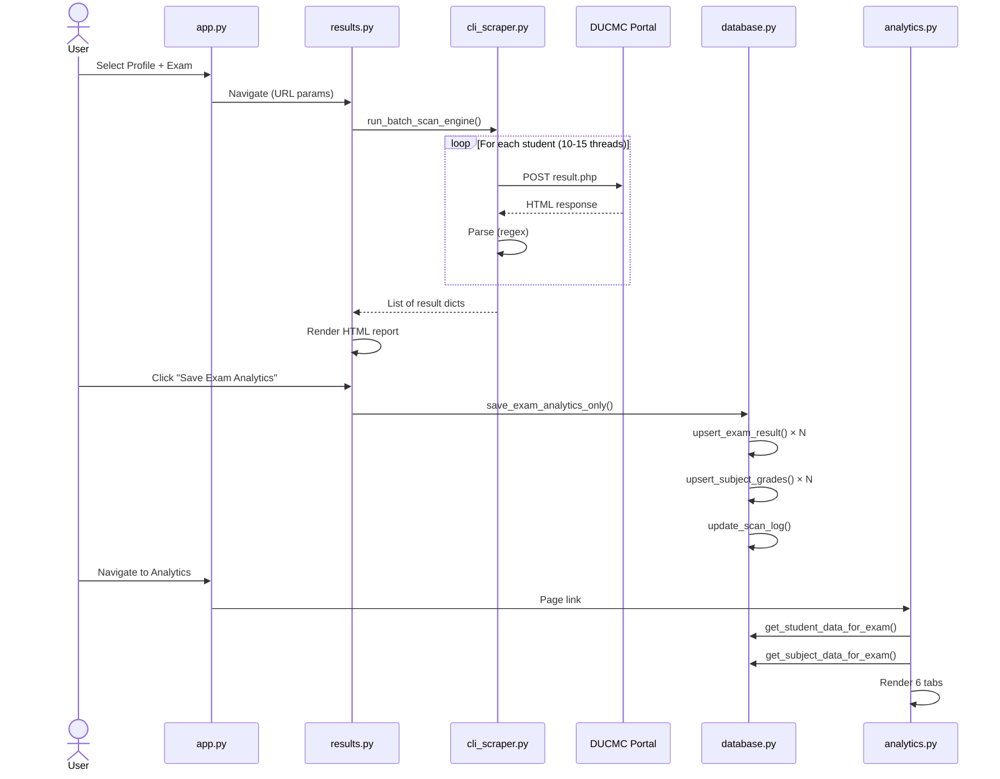

### Deep Analysis Flow (Per Student)

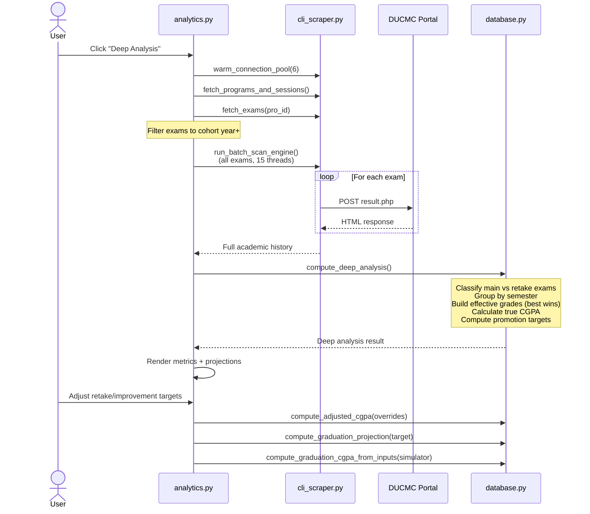

### Automated Monitoring Flow

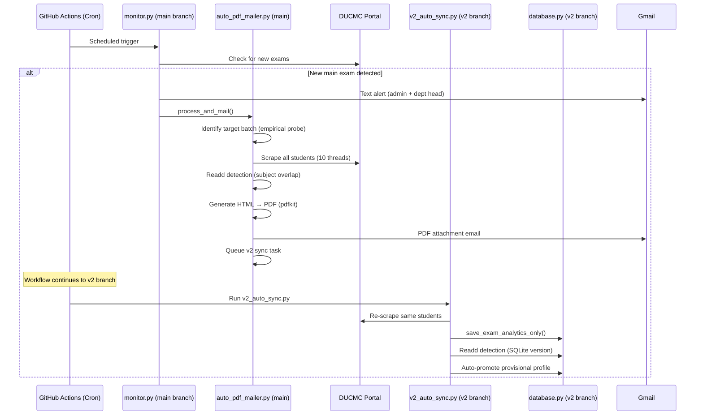

---

## 9. Core Algorithms

### 9.1 Retake-Aware CGPA (Best Grade Wins)

For each student, across ALL exams they've ever taken:

1. For each subject, collect all grade points from all exam appearances
2. **Keep only the best grade** (highest GP) as the "effective grade"
3. Compute credit-weighted average: `CGPA = Σ(GP × credit) / Σ(credit)`

This differs from the portal, which may not correctly account for retakes/improvements.

### 9.2 Subject-Overlap Readd Detection

**Problem:** When a student repeats a year ("readd"), they take the same semester exams as the junior batch. But improvement/retake students also appear in exam results for a different semester. How to distinguish?

**Algorithm:**

```
1. Build REFERENCE FINGERPRINT from regular batch:
   - Subject codes taken by ≥30% of valid regular students (≥4 subjects)

2. For each candidate from senior batches:
   - Fetch their subjects for this exam
   - Compute OVERLAP RATIO = |candidate_subjects ∩ reference| / |reference|
   - Compute LOAD RATIO = |candidate_subjects| / |reference_subjects|

3. GENUINE READD if:
   - Overlap ratio ≥ 50% AND
   - Load ratio ≥ 70%
   
4. Otherwise: GHOST (improvement/retake student) → skip
```

### 9.3 Performance Archetype Classification

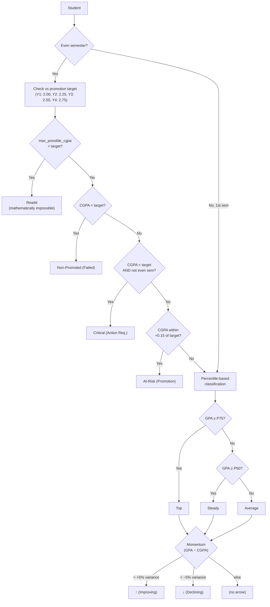

### 9.4 Graduation Projection Math

Given:
- `adj_cgpa` = current adjusted CGPA
- `adj_credits` = total credits completed
- `target_cgpa` = desired graduation CGPA
- `remaining_credits` = sum of credits for remaining semesters

```
required_avg_gpa = (target_cgpa × (adj_credits + remaining_credits) − adj_cgpa × adj_credits) / remaining_credits
```

If `required_avg_gpa > 4.00` → **Mathematically impossible**
If `required_avg_gpa ≤ 0` → **Already met**

### 9.5 Promotion Threshold System

| Year | Odd Semester (1st) | Even Semester (2nd) | CGPA Threshold |
|------|-------------------|---------------------|----------------|
| Year 1 | 1st Semester | 2nd Semester | 2.00 |
| Year 2 | 3rd Semester | 4th Semester | 2.25 |
| Year 3 | 5th Semester | 6th Semester | 2.50 |
| Year 4 | 7th Semester | 8th Semester | 2.75 |

After **even** semesters, promotion decisions are made. The system calculates what GPA a student needs in the next semester to reach/maintain the threshold.

### 9.6 Trajectory Classification (Linear Regression)

For each student with ≥2 semesters of data:

```python
slope = np.polyfit(semester_numbers, gpa_values, degree=1)[0]

if slope > 0.08:    trajectory = "Rising"
elif slope < -0.08: trajectory = "Declining"
else:
    # Check for V-shape recovery
    if valley is interior AND both ends > valley + 0.2:
        trajectory = "Recovery (V-shape)"
    else:
        trajectory = "Stable"

consistency = max(0.0, 1.0 - std(gpa_values))
```

---

## 10. Feature Catalogue

### Scraping & Data Collection

| # | Feature | Module | Description |
|---|---------|--------|-------------|
| 1 | **Concurrent Batch Scanning** | cli_scraper | 10–15 worker threads with queue-based task distribution |
| 2 | **Connection Pre-Warming** | cli_scraper | 6 parallel SSL handshakes cached for 1hr. Cold start: 20s → 3-4s |
| 3 | **Auto Session Discovery** | cli_scraper | Tries all sessions when sess_id="AUTO" to find readd students |
| 4 | **Smart Exam Classification** | cli_scraper | Scoring system classifies exams into main/retake with probe verification |
| 5 | **User-Agent Rotation** | cli_scraper | 5 browser UA strings to avoid WAF blocks |
| 6 | **Exponential Backoff** | cli_scraper | 4 retries with jitter on network errors |

### Profile Management

| # | Feature | Module | Description |
|---|---------|--------|-------------|
| 7 | **Provisional Batches** | app, database | Create student roster before results publish. Auto-promotes on first result import |
| 8 | **Add Student to Profile** | app | Scan + verify + add individual students from any session |
| 9 | **Batch Scan All Exams** | app, results | One-click sequential scan of all detected main semester exams |
| 10 | **Profile Export/Import** | cli_scraper | JSON-based backup and restore |
| 11 | **Senior Re-add Ranges** | app | Add registration ranges from senior batches in a single scan |

### Analytics & Visualizations

| # | Feature | Tab | Description |
|---|---------|-----|-------------|
| 12 | **GPA Distribution** | Baseline | 40-bin histogram with adaptive axis |
| 13 | **First-Chance Pass Ratio** | Baseline | Donut chart showing % of students passing all subjects first attempt |
| 14 | **Subject Difficulty Ranking** | Baseline | Bar chart sorted by mean GP (passing only) |
| 15 | **Achievement Gradient** | Baseline | Rank vs CGPA line chart |
| 16 | **Grade Distribution** | Baseline | 100% stacked bar, A+ through F per subject |
| 17 | **Batch GPA Trajectory** | Trends | Multi-line chart with spotlight selector and batch median |
| 18 | **Student Trajectory Metrics** | Trends | Regression-based classification (Rising/Declining/V-shape/Stable) |
| 19 | **Retake Success Tracker** | Trends | Success rate, avg GP gain, per-subject breakdown |
| 20 | **Cross-Batch Benchmarking** | Trends | Multi-profile comparison with density curves |
| 21 | **Subject Variance Boxplots** | Advanced | Min-max per subject |
| 22 | **Performance Personas Scatter** | Advanced | 24-color strategic quadrant with momentum/variance axes |
| 23 | **Subject Dependency Heatmap** | Advanced | Pearson correlation matrix |
| 24 | **Cube Pivot** | Pivot | Student × Subject and Subject × Student matrices |
| 25 | **Clearing List + CSV Export** | Clearing | Sortable table with download |

### Deep Analysis & Projections

| # | Feature | Tab | Description |
|---|---------|-----|-------------|
| 26 | **True CGPA Calculator** | Projection | Credit-weighted CGPA using best grades across all attempts |
| 27 | **Shadow GPA Auditing** | database | Portal-claimed vs locally-computed GPA comparison |
| 28 | **Precise Target GPA** | Projection | Exact GPA needed next semester to reach promotion threshold |
| 29 | **Pending Retake Tracker** | Projection | List of still-failing subjects with interactive "Pass" checkbox |
| 30 | **Improvement Candidates** | Projection | Courses with GP ≤ 2.75 eligible for improvement |
| 31 | **Adjusted CGPA** | Projection | Real-time CGPA recomputation as user toggles retake/improvement targets |
| 32 | **Graduation Target Calculator** | Projection | Slider to set target CGPA → shows required avg GPA per remaining semester |
| 33 | **Graduation CGPA Simulator** | Projection | Summary mode (GPA per semester) or Detailed mode (per-course GP sliders with elective credit caps) |
| 34 | **Semester-wise Breakdown** | Projection | Official vs Adjusted GPA/CGPA per semester with colored deltas |
| 35 | **Special Exam Indicator** | Projection | Tags improvement/retake semesters with red "(Special)" label |

### Strategic Intelligence

| # | Feature | Module | Description |
|---|---------|--------|-------------|
| 36 | **Strategic Analysis Brief** | analytics | Executive summary: batch momentum, honours pipeline, risk cases, rising stars |
| 37 | **Readd Alert** | analytics | Flags students mathematically unable to reach promotion threshold |
| 38 | **Failed Promotion Alert** | analytics | Students below CGPA threshold after even semesters |
| 39 | **Critical At-Risk Alert** | analytics | Students falling below threshold mid-year |
| 40 | **At-Risk Alert** | analytics | Students within +0.15 margin of threshold |
| 41 | **Bottleneck Subject Detection** | analytics | Subject with lowest cohort average GP |
| 42 | **Synergy Detection** | analytics | Strongest Pearson correlation between subject pairs |
| 43 | **Incomplete History Detection** | analytics | Identifies readd students with fewer exam records than expected, with "Scan & Fix" button |

### Automation & Monitoring

| # | Feature | Module | Description |
|---|---------|--------|-------------|
| 44 | **Exam Publication Watcher** | exam_monitor | GitHub Actions cron polls portal for new exams across 3 departments |
| 45 | **Auto PDF Report** | auto_pdf_mailer | Generates and emails batch PDF reports to admin + dept heads |
| 46 | **Auto Readd Detection** | auto_pdf_mailer, v2_auto_sync | Subject-overlap fingerprinting finds re-admitted senior students |
| 47 | **Auto Profile Promotion** | auto_pdf_mailer, v2_auto_sync | Provisional batches auto-promoted on first result import |
| 48 | **Cross-Branch Sync** | auto_pdf_mailer → v2_auto_sync | Main branch queues tasks for v2 branch to replay into SQLite |
| 49 | **Portal Uptime Monitor** | portal_monitor | Checks portal health, alerts only on state transitions |
| 50 | **Readd Notifications** | v2_auto_sync | Saves readd detection results for analytics dashboard display |

---

## 11. CI/CD & Automation

### GitHub Actions Workflow: `portal_health.yml`

```yaml
# Trigger: repository_dispatch (type: check_uptime) or manual
# Runner: ubuntu-latest, Python 3.12
# Steps:
#   1. Checkout code
#   2. Restore state.json from Actions Cache
#   3. Run health_check.py (with SMTP secrets)
#   4. Save state.json back to cache
```

**Key Design:** Uses Actions Cache (not git commits) to persist state across runs. Avoids polluting git history with automated commits.

### Exam Monitor Workflow (referenced but triggered externally)

The exam monitor (`monitor.py`) is designed to be triggered by GitHub Actions (cron or repository_dispatch). It writes to `GITHUB_OUTPUT` to signal downstream jobs:
- `new_exams=true` → trigger PDF generation and v2 sync
- `new_exams=false` → silent exit

### Process Safety

Both `auto_pdf_mailer.py` and `health_check.py` use a **directory-based atomic lock** for JSON file writes:

```python
@contextlib.contextmanager
def file_process_lock(lock_path, timeout=30):
    lock_dir = lock_path + ".lock"
    # Spin-wait with os.mkdir() (atomic on all OSes)
    # 200ms poll interval, 30s timeout with fallback
```

This prevents concurrent GitHub Actions jobs from corrupting `saved_profiles.json` or `state.json`.

---

## 12. Test Suite

### `tests/test_database.py` — 18+ Unit Tests

| Test | What It Verifies |
|------|-----------------|
| `test_save_profile_creates_profile_row` | Profile creation and retrieval |
| `test_no_duplicate_exam_results_on_double_save` | ACID: double save doesn't duplicate rows |
| `test_no_duplicate_students_on_double_upsert` | Student upsert idempotency |
| `test_no_duplicate_subject_grades` | Subject grade upsert idempotency |
| `test_delete_profile_cascades` | FK cascade: profiles→students→exam_results→subject_grades |
| `test_rename_profile_no_orphans` | Rename updates all child table references |
| `test_effective_cgpa_uses_best_grade` | Retake-aware CGPA: CS101 C→A, effective CGPA=3.5 |
| `test_should_rescan_*` (3 tests) | Scan log TTL behavior |
| `test_save_analytics_only_does_not_touch_profile` | Analytics-only save doesn't alter student roster |
| `test_get_semester_courses_include_all_electives` | Elective handling for CSE 7th sem, Civil 8th sem |
| `test_cgpa_calculation_includes_fail_courses` | GP=0.00 courses still count credits |
| `test_get_student_data_for_exam_optimized` | Bulk query: GPA fallback, counts, first_chance_fail |
| `test_longitudinal_data_civil_consecutive_semesters` | "3rd Year 6th Semester" → sem_num=6 (not 10) |
| `test_retake_success_stats_chronological_first_attempt` | first_gp by exam_id order |
| `test_compute_per_semester_breakdown_adjusted_and_fallback` | Adjusted vs official GPA comparison |
| `test_compute_graduation_projection_uses_adj_cgpa_and_credits` | Projection respects adj_cgpa override |
| `test_get_semester_from_code_unhyphenated` | Subject code parsing variants |
| `test_fallback_calculations_with_null_credits` | NULL credit_hours → 3.0 fallback |

### `tests/test_full_system.py` — 5 Integration Tests

| Test | What It Verifies |
|------|-----------------|
| `test_cli_batch_manager_db_sync` | Full CRUD cycle: create→add→remove→delete |
| `test_retake_improvement_logic` | 3-phase retake: D→A+→B, effective stays A+ |
| `test_connection_pre_warming` | Mocked HTTP: 1 GET + 5 HEAD requests |
| `test_duplicate_and_unique_guardrails` | Case-insensitive profile existence, deduplication |
| `test_get_batch_first_participation_years_highest_count` | Picks exam with highest student count |

---

## 13. File Inventory

| File | Lines | Size | Purpose |
|------|-------|------|---------|
| [app.py](file:///c:/Users/Ucc/Downloads/result%20finder%20separate/app.py) | 445 | 24KB | Dashboard hub, sidebar, profile management |
| [cli_scraper.py](file:///c:/Users/Ucc/Downloads/result%20finder%20separate/cli_scraper.py) | 1,953 | 92KB | Scraping engine, batch scanning, HTML reports |
| [database.py](file:///c:/Users/Ucc/Downloads/result%20finder%20separate/database.py) | 2,605 | 110KB | SQLite layer, CGPA math, projections |
| [pages/analytics.py](file:///c:/Users/Ucc/Downloads/result%20finder%20separate/pages/analytics.py) | 2,183 | 99KB | OLAP analytics dashboard (6 tabs) |
| [pages/results.py](file:///c:/Users/Ucc/Downloads/result%20finder%20separate/pages/results.py) | 256 | 10KB | Exam scan execution page |
| [pages/transcript.py](file:///c:/Users/Ucc/Downloads/result%20finder%20separate/pages/transcript.py) | 170 | 7KB | Individual student academic record |
| [ui_components.py](file:///c:/Users/Ucc/Downloads/result%20finder%20separate/ui_components.py) | 311 | 12KB | Design system (CSS/JS/fonts) |
| [pdf_extractor.py](file:///c:/Users/Ucc/Downloads/result%20finder%20separate/pdf_extractor.py) | 153 | 5KB | Syllabus PDF → credit_mapping.json |
| [v2_auto_sync.py](file:///c:/Users/Ucc/Downloads/result%20finder%20separate/v2_auto_sync.py) | 260 | 11KB | Cross-branch sync worker |
| [exam_monitor/monitor.py](file:///c:/Users/Ucc/Downloads/result%20finder%20separate/exam_monitor/monitor.py) | 208 | 9KB | Exam publication detector |
| [exam_monitor/auto_pdf_mailer.py](file:///c:/Users/Ucc/Downloads/result%20finder%20separate/exam_monitor/auto_pdf_mailer.py) | 488 | 20KB | PDF report generator + emailer |
| [exam_monitor/find_latest.py](file:///c:/Users/Ucc/Downloads/result%20finder%20separate/exam_monitor/find_latest.py) | 35 | 1KB | Latest exam finder utility |
| [exam_monitor/sync_state.py](file:///c:/Users/Ucc/Downloads/result%20finder%20separate/exam_monitor/sync_state.py) | 29 | 1KB | State reset utility |
| [portal_monitor/health_check.py](file:///c:/Users/Ucc/Downloads/result%20finder%20separate/portal_monitor/health_check.py) | 194 | 8KB | Portal uptime monitor |
| [credit_mapping.json](file:///c:/Users/Ucc/Downloads/result%20finder%20separate/credit_mapping.json) | 296 | 7KB | Department-isolated credit weights |
| [exam_monitor/known_exams.json](file:///c:/Users/Ucc/Downloads/result%20finder%20separate/exam_monitor/known_exams.json) | 282 | — | Known exam IDs per department |
| [readd_notifications.json](file:///c:/Users/Ucc/Downloads/result%20finder%20separate/readd_notifications.json) | 10 | — | Readd detection notifications |
| [portal_monitor/state.json](file:///c:/Users/Ucc/Downloads/result%20finder%20separate/portal_monitor/state.json) | 4 | — | Portal health state |
| [tests/test_database.py](file:///c:/Users/Ucc/Downloads/result%20finder%20separate/tests/test_database.py) | 653 | — | 18+ database unit tests |
| [tests/test_full_system.py](file:///c:/Users/Ucc/Downloads/result%20finder%20separate/tests/test_full_system.py) | 180 | — | 5 integration tests |
| [prd.json](file:///c:/Users/Ucc/Downloads/result%20finder%20separate/prd.json) | 420 | — | Product requirements (15 user stories) |
| [.github/workflows/portal_health.yml](file:///c:/Users/Ucc/Downloads/result%20finder%20separate/.github/workflows/portal_health.yml) | 44 | 1KB | GitHub Actions uptime workflow |
| [Launch_Dashboard.bat](file:///c:/Users/Ucc/Downloads/result%20finder%20separate/Launch_Dashboard.bat) | 13 | — | Windows one-click launcher |
| [requirements.txt](file:///c:/Users/Ucc/Downloads/result%20finder%20separate/requirements.txt) | 7 | — | Python dependencies |
| [.streamlit/config.toml](file:///c:/Users/Ucc/Downloads/result%20finder%20separate/.streamlit/config.toml) | 12 | — | Streamlit configuration |

**Total:** ~9,400+ lines of application code across 15 Python modules

---

> *This documentation was generated from a complete analysis of every file in the repository across both the `main` and `v2` branches. Every function, feature, algorithm, and data flow has been traced end-to-end from the source code.*
